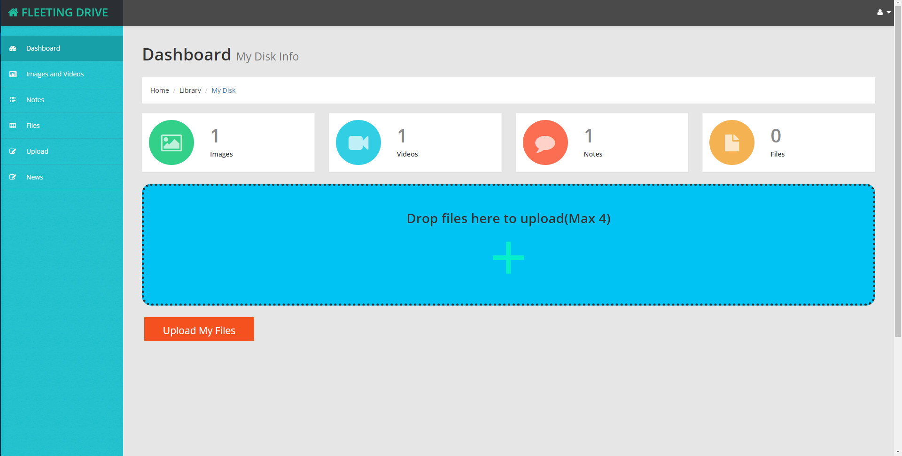
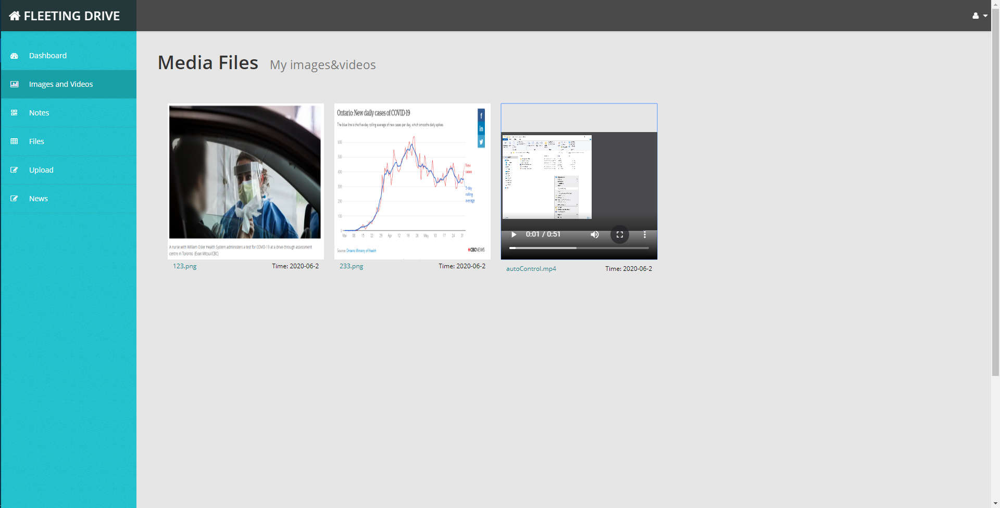
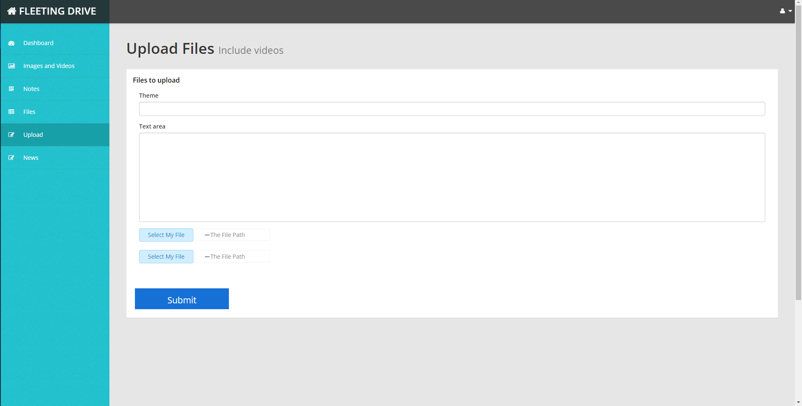
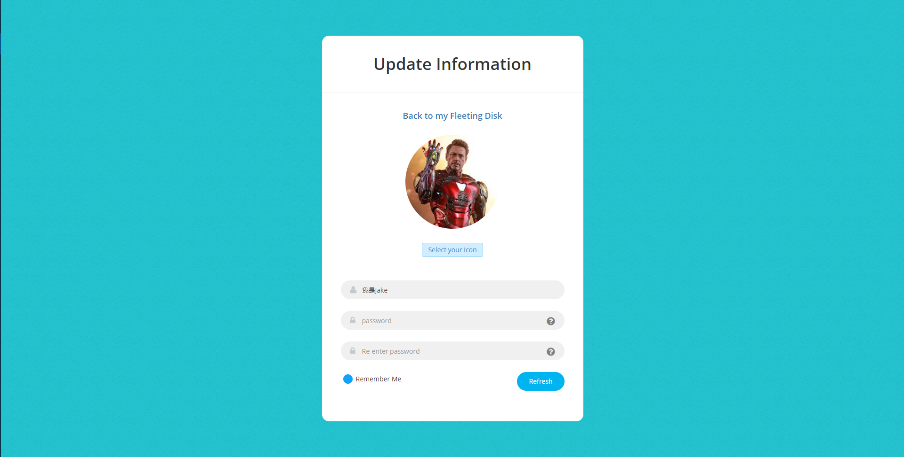

# Fleeting Disk

This is a small personal network disk. Free to register, login, upload files, publish articles, browse and download files.

This personal disk uses MongoDB, Koa, Bootstrap,  Dropzone.js, Koa-multer and art-template.

In addition, a crawler program is integrated in the program, which will automatically crawl and update the hot news of Weibo.

Since **it is just an elementary practice project**, the API was not designed well at the beginning of the preparation. Thus, welcome to modify this project.  (ps: Mongoose / GraphQL  could optimize  the related APIs ).

## Usage

1. Install all the dependencies:

```js
$ npm install 
```

​			The server is listening on the port 3000;

2. Link your own MongoDB, create related categories(mine is "mongocrud/disk" and "mongocrud/session"), and change the Database link in modules/config.js

3.  Run  app.js

   ```javascript
   node app.js
   ```

   

## Screenshots

Home Page：




Media Files Page:




Upload Page:




Update userInfo:




`Wish you guys have a nice day!`